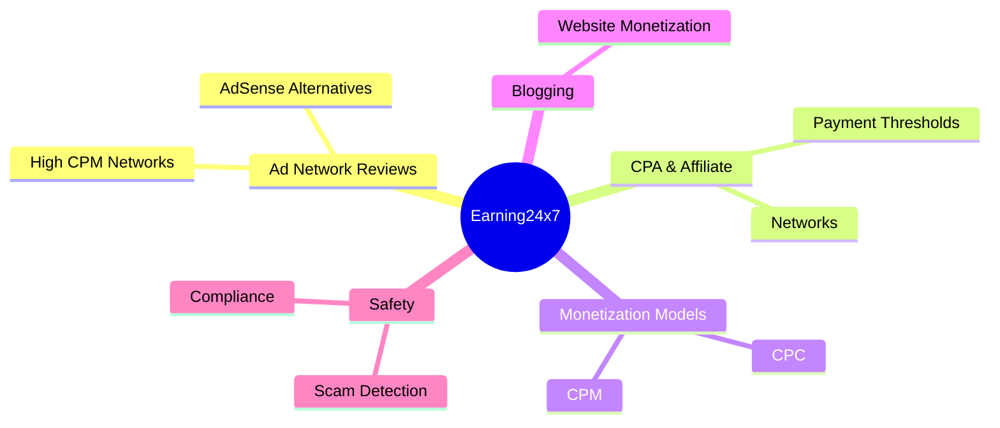

# Mind Map Generator

Generate a clear, hierarchical mind map from the given content. The map must
reflect the source faithfully — no invented facts, no fluff, no promotional
language.

## Output format

Always deliver **two** forms so the map works anywhere:

1. **Mermaid `mindmap`** — the primary deliverable.
2. **Markdown tree** (`- topic > branch > leaf`) — a text fallback for places
   Mermaid is not supported (email, chat, plain files).

For Jekyll blog posts, if Mermaid is not already enabled in the site, add the
diagram with an HTML comment noting it can be swapped for a `` block, or embed the markdown tree directly if the site renders
lists natively.

## Mermaid rules

- Use the `mindmap` diagram type only (not `graph`).
- Root node is the single central topic.
- Depth: at most 4 levels (root, branch, sub-branch, leaf). Go deeper only if
  the source genuinely requires it.
- Keep every node label under ~8 words. Short noun phrases, not sentences.
- Do not wrap labels in quotes unless they contain `:` or `(` — if quoted,
  use double quotes.
- Indent child nodes with 4 spaces per level.
- No emojis unless the user explicitly asks.
- Keep it scannable: 7 ± 2 top-level branches max.

Example:



## Workflow

1. Read the source material fully (the post, plan, notes, or topic given).
2. Identify the central topic, main sections, and sub-points.
3. Build the hierarchy in the exact order the source presents it.
4. Verify every branch traces back to the source. Remove anything invented.
5. Render the Mermaid block and the markdown tree.
6. If embedding into a Jekyll post, place the diagram near the section it
   summarizes and keep the existing front matter untouched.

## Markdown tree fallback

```
Earning24x7
  - Ad Network Reviews
    - AdSense Alternatives
    - High CPM Networks
  - CPA & Affiliate
    - Networks
    - Payment Thresholds
  - Monetization Models
    - CPC
    - CPM
  - Blogging
    - Website Monetization
  - Safety
    - Scam Detection
    - Compliance
```

## Style notes

- Prefer the source's own terminology over paraphrasing.
- Split oversized branches; merge near-empty ones. Never reorder the source.
- When the source is ambiguous or a branch has no clear home, keep it attached
  to the closest parent rather than inventing a new category.
